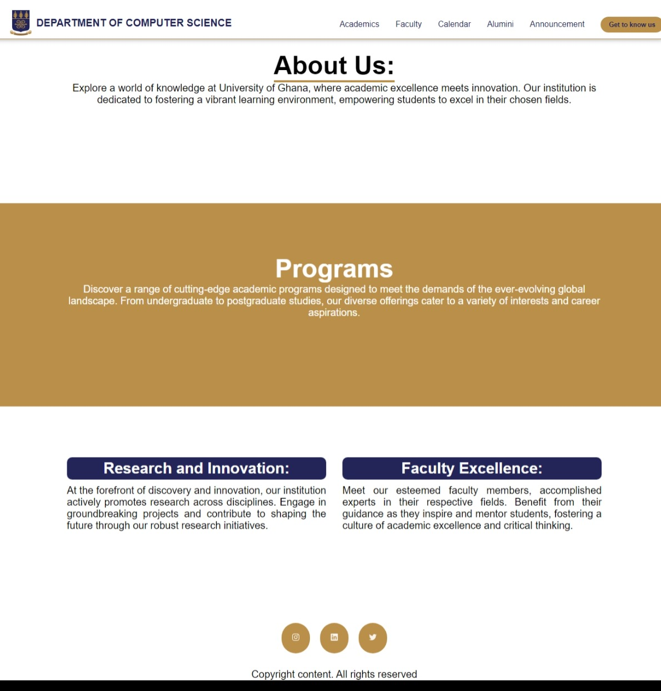
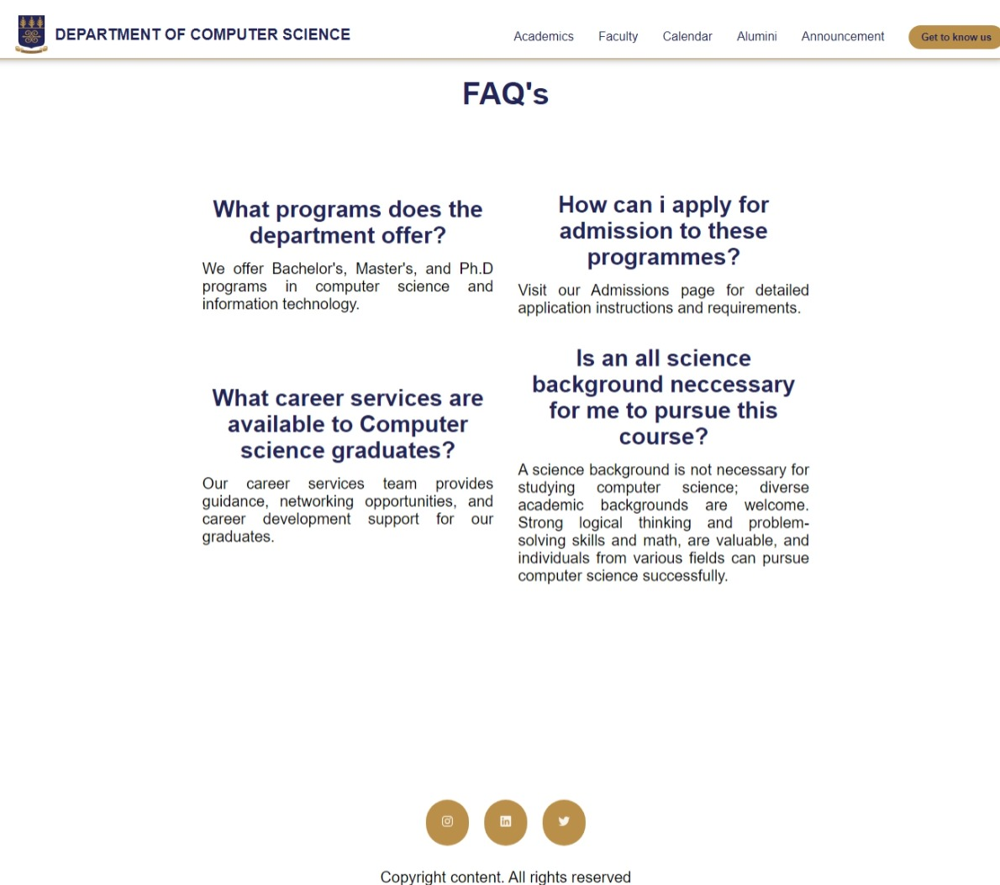
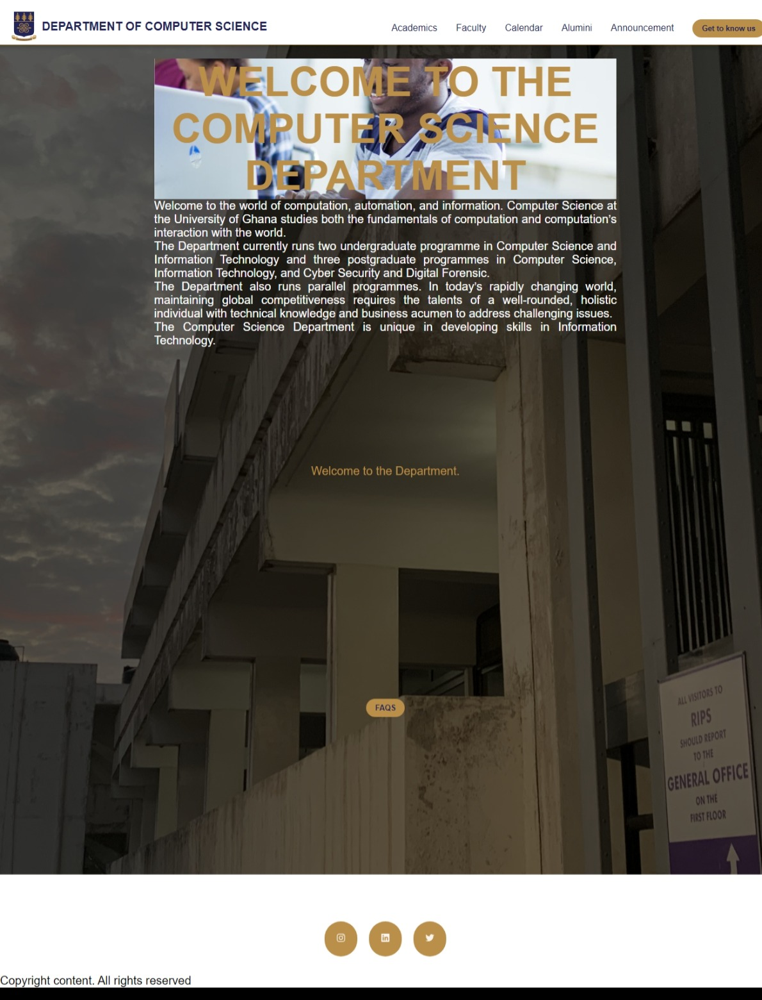

# 11356940_DCIT205
Charis-Eirene Ntim-11356940

# University of Ghana Department of Computer Science

Welcome to the official website repository of the University of Ghana Department of Computer Science! This repository contains information about our department, programs, faculty, and more.

## Home Page

Visit our [official website](https://www.ug.edu.gh/computerscience) for the latest updates, news, and information about the Department of Computer Science at the University of Ghana. Explore our commitment to academic excellence, research, and innovation.

## FAQ

Have questions about admissions, programs, or campus life within the Department of Computer Science? Check out our [FAQ section](FAQ.md) for answers to commonly asked questions. If you don't find what you're looking for, feel free to reach out to our department office for personalized assistance.

## Alumni

Discover the accomplishments and success stories of our esteemed alumni in the [Alumni section](Alumni.md). Connect with a global network of professionals who have made significant contributions to the field of computer science.

## Announcements

Stay informed about the latest announcements, events, and important information from the Department of Computer Science. The [Announcements section](Announcements.md) provides a comprehensive overview of recent developments, ensuring you don't miss out on any important news.

## Get to Know Us

Learn about the unique culture and values that define the Department of Computer Science at the University of Ghana in the [Get to Know Us section](GetToKnowUs.md). Discover our mission, vision, and the diverse community that makes our department a hub for learning and innovation.

## Faculty

Meet the dedicated faculty members who contribute to our world-class education. The [Faculty section](Faculty.md) introduces you to our professors, researchers, and mentors who are passionate about guiding students on their academic journeys.

## Academics

Explore the diverse academic programs and courses offered by the Department of Computer Science. The [Academics section](Academics.md) provides detailed information on majors, minors, research opportunities, and the overall academic experience that awaits you.

 
  -1.jpeg>) 
  
   
    
    -1.jpeg>)
